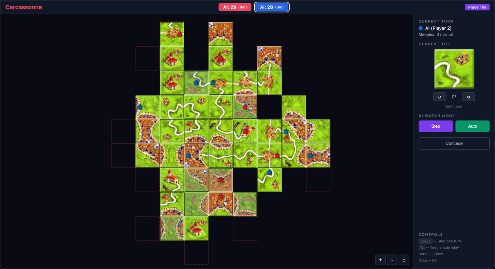

# Carcassonne - Kotlin/React

Kotlin reimplementation of the [Python Carcassonne engine](https://github.com/wingedsheep/carcassonne) with a React web frontend.



## Performance

The engine is fast — designed for AI and reinforcement learning workloads where millions of games need to be simulated. On a single thread it plays **~700+ complete games per second** (~1.4ms per game, ~142 actions per game), making it well-suited for MCTS and other search-based agents.

## Architecture

See [docs/architecture.md](docs/architecture.md) for the full architecture document.

**Key design decisions:**
- Immutable `GameState` for safe RL branching (no deep copy needed)
- Pre-computed tile rotations (4 variants per tile definition, created at startup)
- `EdgeProfile` packs 4 edge terrain types into a single Int for O(1) tile fitting
- Sparse board (`HashMap<Coordinate, PlacedTile>`) - no fixed-size array
- Frontier set for valid placement generation (no full board scan)
- BFS flood fill for structure detection (cities, roads, farms)
- kotlinx-serialization for state snapshots (CBOR for speed, JSON for debugging)

## Project structure

- `utils/` - Game engine library. Zero UI dependencies. Package: `com.wingedsheep.carcassonne`
- `app/` - Ktor web server + React SPA. Package: `com.wingedsheep.app`
- `docs/` - Architecture and design documents

## Build & run

```bash
./gradlew build          # build everything
./gradlew :utils:test    # run engine tests
./gradlew run            # start web server
```

## Conventions

- All model types are `@Serializable` data classes
- Engine code must not print or log (no side effects)
- State transitions return new `GameState`, never mutate
- Tile definitions go in `utils/.../tile/` as deck objects
- Tests live next to source in `src/test/kotlin/`
- Reference Python source: `/Users/vincent/Git/carcassonne`
